# Earthquake Data Engineering Pipeline — Microsoft Fabric Medallion Architecture

## Overview

This project implements an **Earthquake Data Engineering Pipeline** using **Microsoft Fabric Lakehouse** and the **Medallion Architecture**.

The pipeline processes earthquake events from the **USGS Earthquake API** through three data layers:

**USGS Earthquake API → Bronze → Silver → Gold → Analytics**

Each layer has a dedicated Fabric notebook and progressively improves the data quality and usability.

---

## Architecture

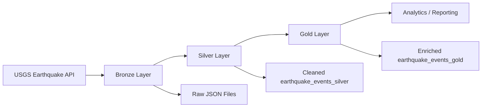

### Medallion Layers

| Layer | Purpose | Main Output |
|---|---|---|
| **Bronze** | Ingest raw earthquake data from the USGS API | JSON files in Lakehouse Files |
| **Silver** | Select, reshape, rename, and standardize fields | `earthquake_events_silver` |
| **Gold** | Enrich data with country information and classify significance | `earthquake_events_gold` |

---

# 1. Data Source

The pipeline uses the **USGS Earthquake API** to retrieve earthquake events in GeoJSON format.

The Bronze notebook constructs an API request using a start date and end date:

```text
https://earthquake.usgs.gov/fdsnws/event/1/query
```

The response is converted to JSON and stored in the Fabric Lakehouse `Files` area.

The ingestion logic is designed around a date range, allowing the pipeline to process a specific period of earthquake events.

---

# 2. Bronze Layer

## Purpose

The Bronze layer is responsible for **raw data ingestion**.

The notebook:

1. Builds the USGS API URL.
2. Sends a `GET` request.
3. Validates the HTTP response.
4. Extracts the API `features`.
5. Saves the raw earthquake records as JSON.
6. Reads the JSON into a Spark DataFrame for further processing.

### Storage

Raw files are stored under:

```text
/lakehouse/default/Files/
```

The file naming convention is:

```text
{start_date}_earthquake_data.json
```

Example:

```text
2026-07-20_earthquake_data.json
```

### Bronze Notebook

```text
Bronze layer.ipynb
```


## Add start date parameter to bronze notebook in pipeline

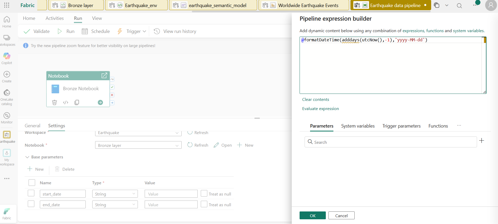

## Add end date parameter to bronze notebook in pipeline

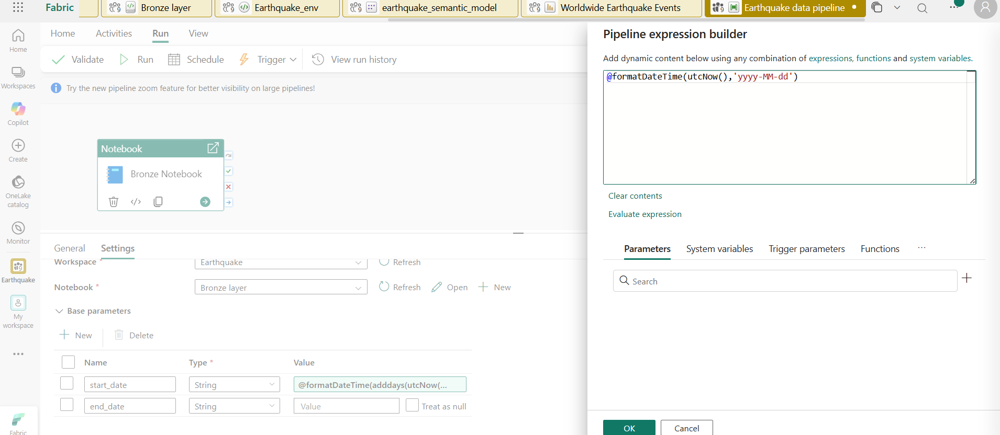
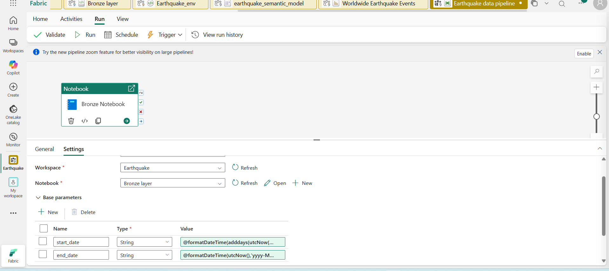


---

# 3. Silver Layer

## Purpose

The Silver layer transforms the raw JSON data into a cleaner and more structured dataset.

The notebook reads the Bronze JSON file and extracts the required earthquake attributes.

### Selected fields

The transformation creates the following structure:

| Column | Description |
|---|---|
| `id` | Unique earthquake event identifier |
| `longitude` | Longitude extracted from geometry |
| `latitude` | Latitude extracted from geometry |
| `elevation` | Elevation/depth-related coordinate value |
| `title` | Earthquake title |
| `place_description` | Location description |
| `sig` | Earthquake significance score |
| `mag` | Earthquake magnitude |
| `magType` | Magnitude type |
| `time` | Earthquake occurrence timestamp |
| `updated` | Last update timestamp |

The nested GeoJSON fields are flattened using Spark column expressions.

For example:

```text
geometry.coordinates[0] → longitude
geometry.coordinates[1] → latitude
geometry.coordinates[2] → elevation
```

The nested property fields are also renamed into analysis-friendly column names.

---

## Timestamp Transformation

The USGS timestamps are stored in milliseconds.

The Silver notebook:

1. Divides the timestamp values by `1000`.
2. Converts them into Spark `TimestampType`.
3. Produces readable datetime values.

This is applied to:

```text
time
updated
```

---

## Silver Table

The transformed data is appended to:

```text
earthquake_events_silver
```

Write mode:

```python
df.write.mode("append").saveAsTable("earthquake_events_silver")
```

### Silver Notebook

```text
Silver layer.ipynb
```
## Add start date and end date parameter to silver notebook in pipeline

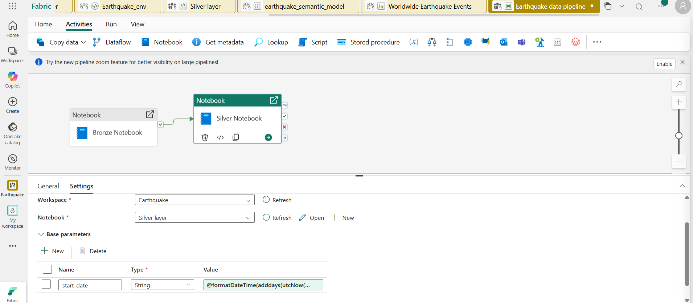
---

# 4. Gold Layer

## Purpose

The Gold layer creates an enriched dataset suitable for analytics and reporting.

The notebook reads recent records from the Silver table and adds additional business-friendly attributes.

---

## Reverse Geocoding

The Gold layer uses the `reverse_geocoder` Python package to derive a country code from earthquake coordinates.

To support this functionality,
 I created a dedicated Microsoft Fabric environment called `Earthquake_env`.The `reverse_geocoder` library was installed in this environment and attached to the notebook before running the Gold layer transformations.


The process uses:

```text
latitude + longitude
        ↓
reverse geocoding
        ↓
country_code
```

A Python UDF is registered so the function can be applied to the Spark DataFrame.

Example output:

```text
country_code = US
```

This enrichment makes the earthquake dataset easier to analyze geographically.

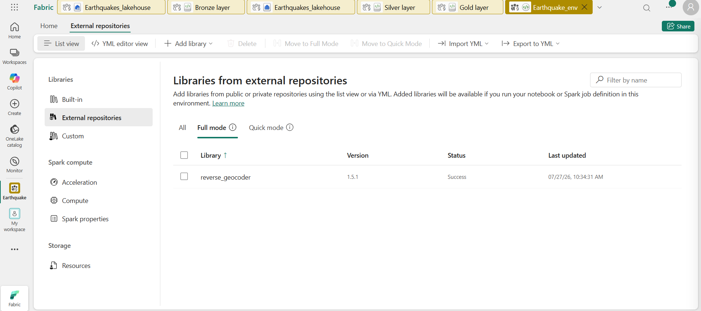
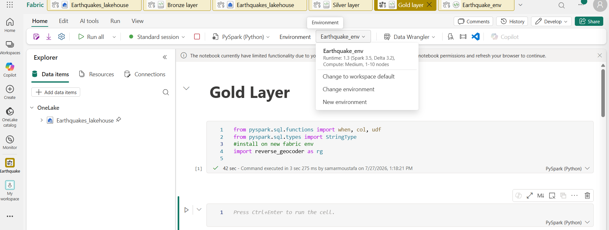


---


# 5. Earthquake Significance Classification

The Gold layer also converts the numerical `sig` value into a categorical classification.

The implemented business rules are:

| Significance Score | Classification |
|---:|---|
| `< 100` | Low |
| `100 – < 500` | Moderate |
| `>= 500` | High |

The resulting column is:

```text
sig_class
```

This provides a simpler business-friendly representation of the earthquake significance score.

---

# 6. Gold Table

The enriched dataset is written to:

```text
earthquake_events_gold
```

The data includes the Silver-layer attributes plus the Gold-layer enrichment such as:

```text
country_code
sig_class
```

The Gold notebook writes the results using append mode:

```python
df_with_location_sig_class.write.mode("append").saveAsTable(
    "earthquake_events_gold"
)
```

### Gold Notebook

```text
Gold layer.ipynb
```
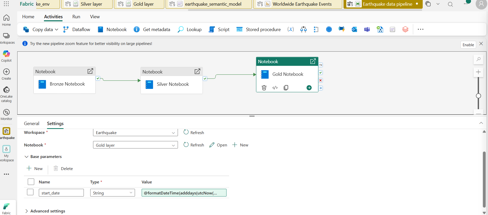


---

# 7. End-to-End Data Flow


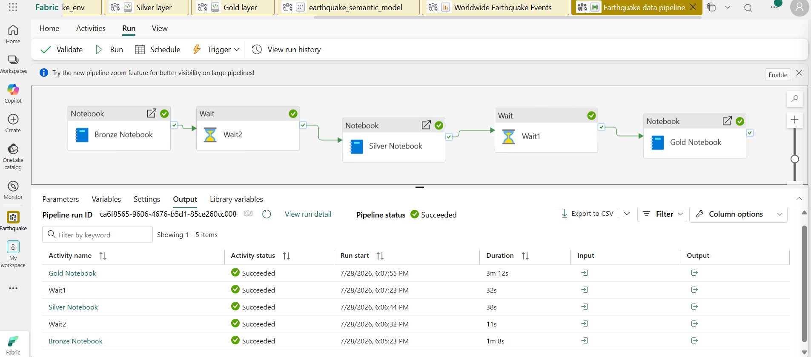
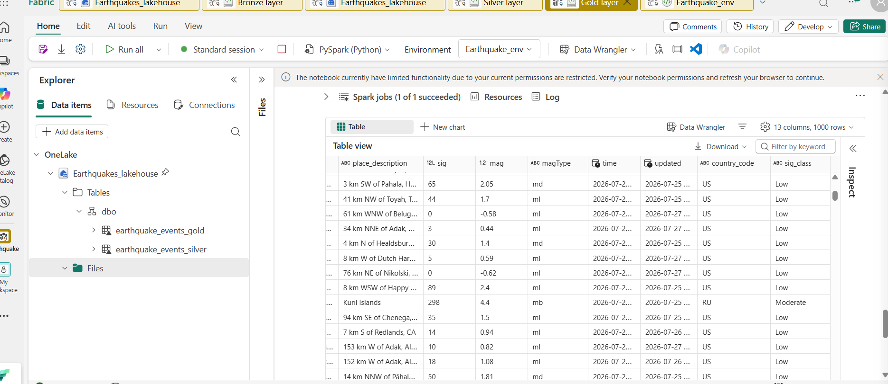


# 8. Monitor Pipeline

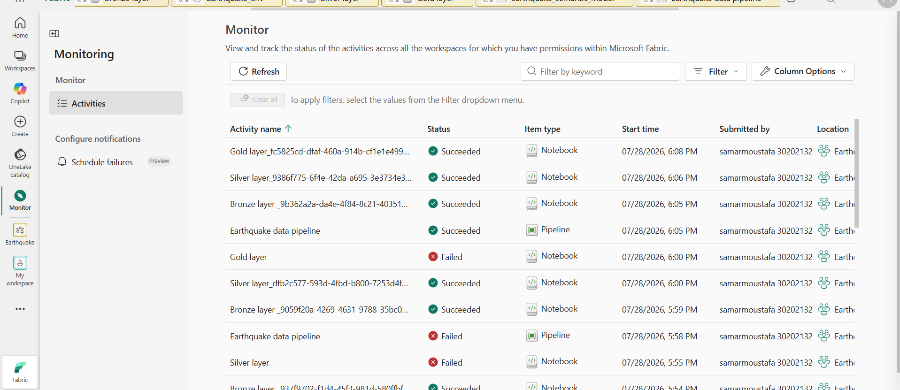

# 9. Power BI Dashboard

The Gold-layer data is used to create an interactive Microsoft Power BI dashboard for earthquake analysis and reporting.

The dashboard provides a visual representation of the processed earthquake data and allows the final Gold-layer dataset to be consumed for analytics.


## Pipeline Execution Date — 25/07/2026

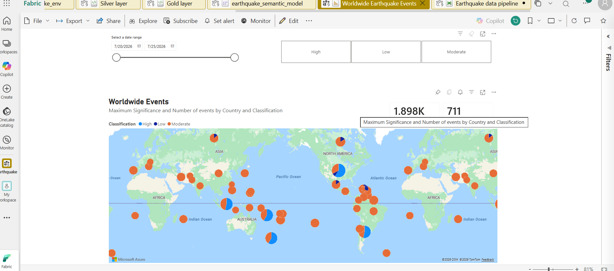
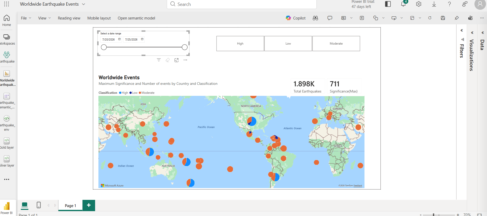
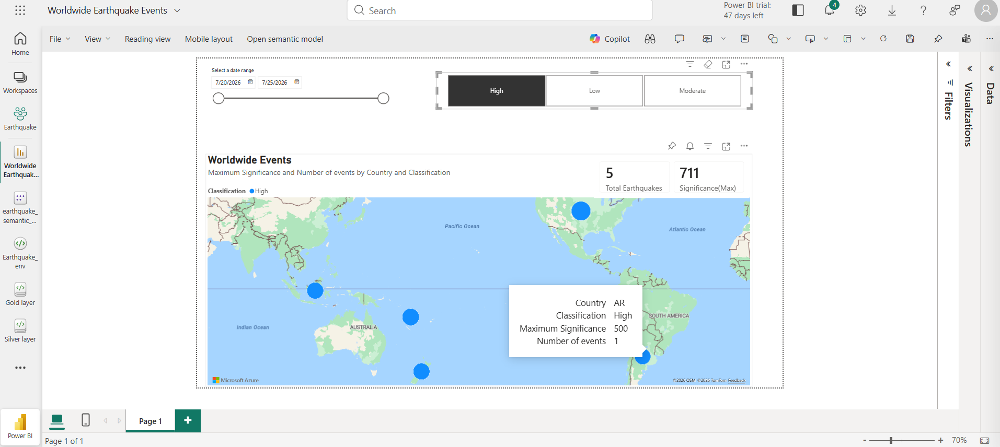
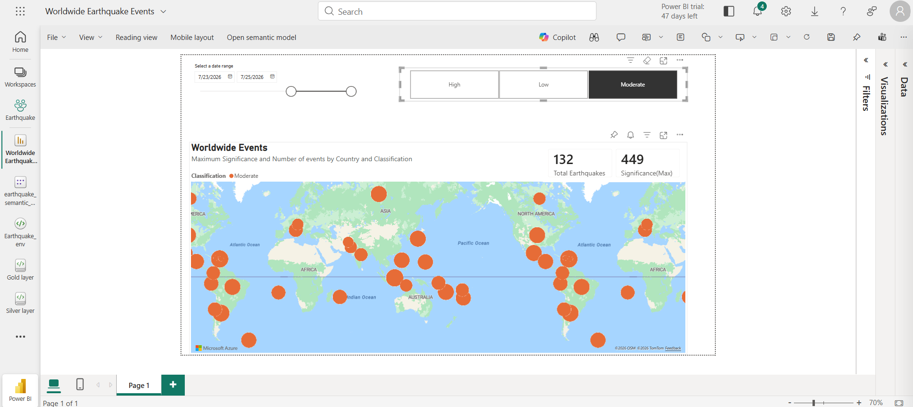
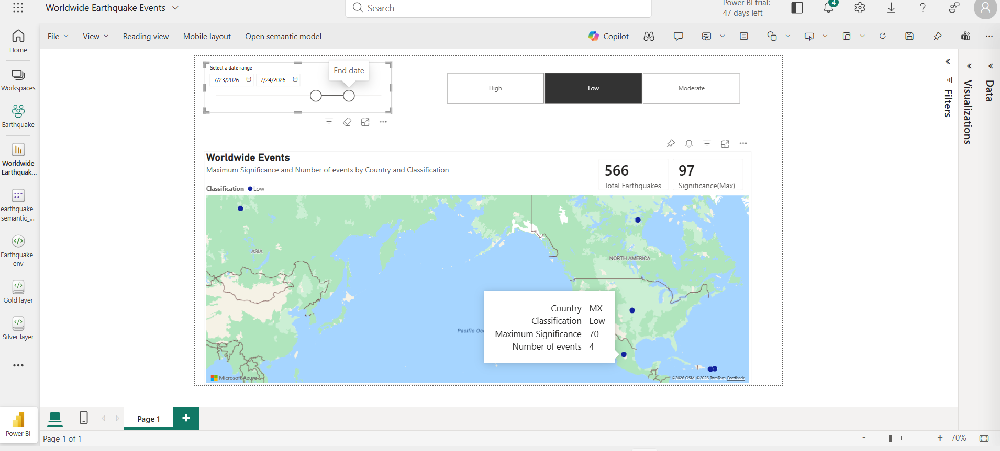


## Pipeline Run Date — 27/07/2026

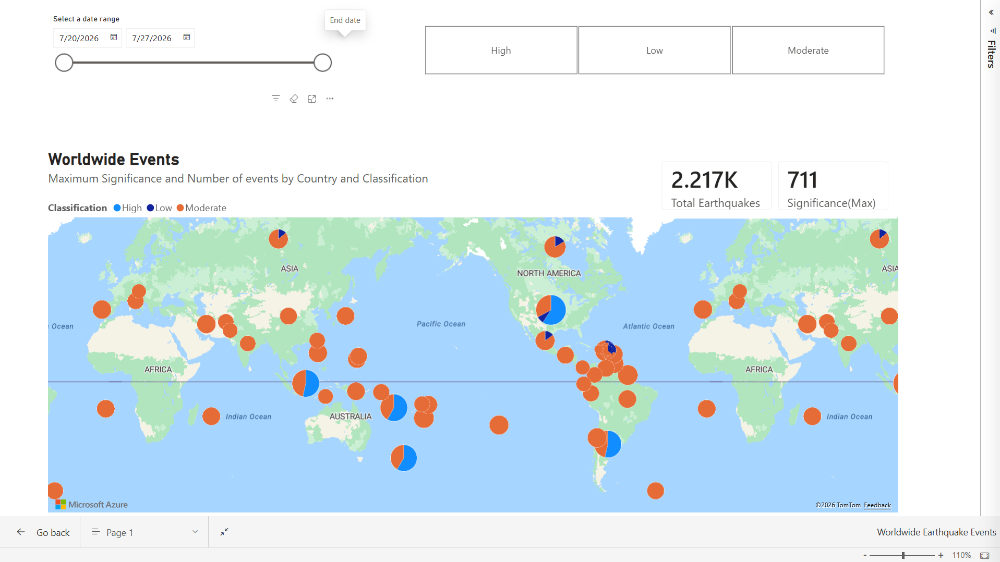

## 10. Microsoft Fabric Components

The project uses the following Microsoft Fabric capabilities:

Fabric Lakehouse for data storage
Spark Notebooks for data engineering
PySpark for distributed transformations
Lakehouse Tables for Silver and Gold datasets
Lakehouse Files for Bronze raw JSON data
Microsoft Fabric Pipelines for orchestration
Fabric Environment for managing the reverse_geocoder Python dependency
Power BI for analytics and visualization

The Fabric environment contains the project layers and supporting resources required to execute the notebooks.


# 11. Technologies
Technology	Usage
Microsoft Fabric	Data engineering platform
Fabric Lakehouse	Data storage and tables
Apache Spark / PySpark	Data processing
Python	API ingestion and enrichment
USGS Earthquake API	Source data
JSON / GeoJSON	Raw data format
reverse_geocoder	Geographic enrichment
Microsoft Fabric Pipelines	Pipeline orchestration
Power BI	Data visualization and analytics
# 12. Key Data Engineering Concepts Demonstrated

This project demonstrates practical implementation of:

Medallion Architecture
Data ingestion from an external REST API
Raw data storage in a Lakehouse
JSON/GeoJSON processing
PySpark DataFrame transformations
Nested-field extraction
Data type conversion
Timestamp standardization
Lakehouse table creation
Append-mode data loading
Data enrichment
Reverse geocoding
User-defined functions (UDFs)
Business-rule classification
Separation of raw, transformed, and analytics-ready data
Pipeline parameterization
Fabric Environment configuration
Python dependency management
Pipeline monitoring
Power BI analytics and visualization
# 13. Data Quality and Transformation Approach

The architecture intentionally separates ingestion from transformation and enrichment.

Bronze

Preserves the incoming API data with minimal transformation.

Silver

Creates a consistent analytical structure by:

Flattening nested fields
Renaming columns
Extracting geographic coordinates
Converting timestamps
Selecting relevant attributes
Gold

Adds business-oriented information by:

Deriving country codes
Categorizing earthquake significance
Preparing the dataset for analytical consumption

This separation makes the pipeline easier to maintain and extend.

# 14.  Project Outcome

The final result is a three-layer Microsoft Fabric data pipeline that transforms raw earthquake API data into an enriched, analytics-ready dataset.

The project demonstrates how Medallion Architecture can be implemented in Microsoft Fabric to separate:

Raw ingestion → Data transformation → Business enrichment → Analytics

The final Gold-layer data is consumed by Power BI to provide a visual analytics layer for the processed earthquake events.

The project also demonstrates pipeline execution for different processing dates, including 25/07/2026 and 27/07/2026.

This provides a clear and scalable foundation for building earthquake analytics and reporting solutions using Microsoft Fabric.
"""


